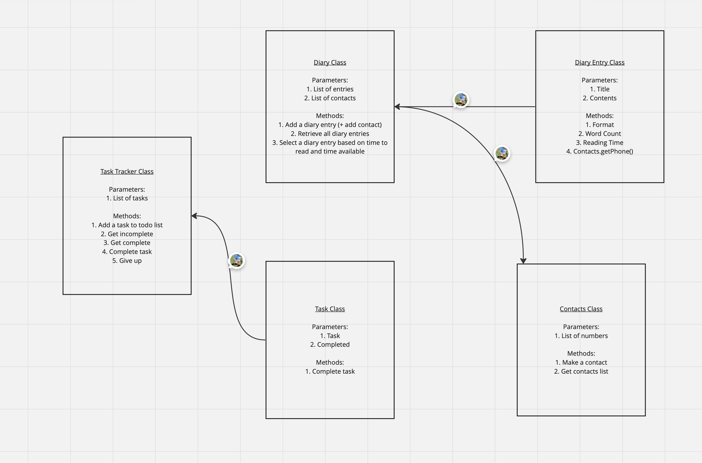

# gs_-design_a_class_system

## Describe the problem
As a user
So that I can record my experiences
I want to keep a regular diary

As a user
So that I can reflect on my experiences
I want to read my past diary entries

As a user
So that I can reflect on my experiences in my busy day
I want to select diary entries to read based on how much time I have and my reading speed

As a user
So that I can keep track of my tasks
I want to keep a todo list along with my diary

As a user
So that I can keep track of my contacts
I want to see a list of all of the mobile phone numbers in all my diary entries

## Design the class system


## Create examples as integration tests
```
'''
Given I have a diary
If I add two entries where only one has a phone number
The contacts list only contains one number
'''
def test_add_two_entries_and_show_contacts():
    diary = Diary()
    with patch('builtins.input', side_effect=['Day Three', 'I made a new friend and this is their number: 07893748621', 'Day Four', 'I made a new friend but I didnt get their number']):
        diary.add_diary_entry()
        diary.add_diary_entry()
    assert diary.contacts.contact_list == ['07893748621']
```

## Create examples of unit tests
```
'''
Given a diary entry
It has a title property
It has a contents property
'''
def test_diary_entry_has_all_its_properties():
    entry = DiaryEntry('Day One', 'My first day of bootcamp')
    assert entry.title == 'Day One'
    assert entry.contents == 'My first day of bootcamp'
```

## Implement the behaviour
```
    def add_diary_entry(self):
        # Parameters
        #   entry: DiaryEntry()
        # Returns
        #   nothing
        # Side effects
        #   adds a new entry to the list of entries
        #   if there is a phone number in the contents add it to contacts.contact_list
        title = input('Whats the title of this entry?')
        contents = input('Start writing your diary.')
        entry = DiaryEntry(title, contents)
        if entry.get_phone_number() != None:
            self.contacts.contact_list.append(entry.get_phone_number())
        self.entries.append(entry)
```
